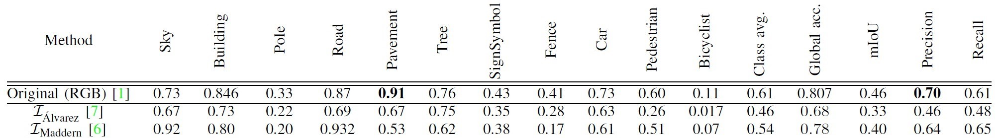

# DeepLearning-CS4240-Paper-Reproduction
**Our take on the Impact of Illumination-Invariant Image Pre-transformation for Contemporary Automotive Semantic Scene Understanding.**

In 2018, Naif Alshammari, Samet Akcay and Toby P. Breckon published their paper On the Impact of Illumination-Invariant Image Pre-transformation for Contemporary Automotive Semantic Scene Understanding. The authors of this paper realized that illumination changes in outdoor environments under non-ideal weather conditions have a negative impact on automotive scene understanding and segmentation performance. The paper presents an evaluation of illumination-invariant image transforms on the CamVid dataset, to see if this improves the state of the art in scene understanding performance.

As part of TU Delft&#39;s CS4240 Deep Learning course, we — Noureddine Begga, Hao Li and Zixuan Wan— attempt to give the reproduction of the results achieved in said paper a try. That is, we try to develop an implementation of the Deep Fully Convolutional Neural Network SegNet and preprocess the CamVid dataset with the illumination invariant image representation. More specifically, our goal is to achieve similar results as Table 1 of the paper (which is copied below).

TABLE 1: Quantitative results are shown as accuracy of the CNN SegNet approach on CamVid test data for RGB and two methods.

The Cambridge-driving Labeled Video Database (CamVid) is the first collection of videos with object class semantic labels, complete with metadata. The database provides ground truth labels that associate each pixel with one of [32 semantic classes](http://mi.eng.cam.ac.uk/research/projects/VideoRec/CamVid/#ClassLabels).

Figure 1: Obtained RGB images and their respective ground truth class labels

**What is a illumination invariant image representation?**

An illumination invariant image representation is a colour representation computed from RGB that removes (or minimises) scene colour variations due to varying scene lighting conditions. This technique was introduced as an intrinsic image to represent the illumination invariant and intrinsic properties in the image [1] with illumination transforms generally computed with reference to the physical properties behind the capture and the presence of colour within the space. In most literature where a type of illumination invariance is applied had as an objective to remove shadows, and to improve scene classification and segmentation.

Figure 2: An example of an RGB image followed by four different illumination invariant images, where all the illumination variations such as shadows are significantly reduced within the scenes.

For our reproduction we will implement two illumination invariance methods and compare these with the results of the authors. For our reproduction we will use the methods of Maddern et al.[2] and Alvarez et al.[3].

**Alvarez et al.**

An illumination-invariant image is a single channel image calculated by combining the three RGB colour channels in the image . To compute the illumination invariant images, we use a single channel feature space combined with three linear sensors as follows for the method of Alvarez et al.:

Where are the tree RGB channels, , and is the logarithmic approximation for the division of two channels in an image , which is computes as follows: 

Where is the value from dividing the two channels and .

**Maddern et al.**

To compute the image for this method, we again convert the 3-channel floating point RGB image into corresponding illumination invariant image as follows:

Where .

This illumination-invariant approach was proposed to improve visual localization, mapping and scene classification for autonomous road vehicles.

**How will we evaluate the performance of using these illumination invariant image representations?**

We will evaluate the performance of automotive scene understanding and segmentation using the SegNet [4] CNN architecture (Figure 3) with the two aforementioned illumination-invariant transformations.

Figure 3: Architecture of the SegNet Convolutional Neural Network

As mentioned before we will use the CamVid dataset with different pixel classes for the SegNet classification task (Figure 1 shows some examples). The authors of the paper used eleven classes: {sky, building, pole, road, pavement, tree, sign, fence, car, pedestrian, bicycle}. The dataset consists of 600 images in total, which we have divided into training, test and validation sets.

**Training the SegNet CNN model**

The authors used a VGG16 [5] network pre-trained on the ImageNet [6] dataset, which is the encoder network within SegNet. An encoder network consists of convolution and pooling layers followed by a decoder network containing convolutional and upsampling layers. The authors have used Stochastic Gradient Descent (SGD) optimization, we however have chosen to use Adam optimization in the hopes of getting better results than the authors.Adam can be looked at as a combination of RMSprop and Stochastic Gradient Descent with momentum. It uses the squared gradients to scale the learning rate like RMSprop and it takes advantage of momentum by using moving average of the gradient instead of gradient itself like SGD with momentum[7]. We used the following hyperparameters: initial learning rate 1x10-3, weight decay 5x10-4 and momentum 0.9. We train the model using the freely provided GPU from Google Colab.

**References**

1. G. D. Finlayson and S. D. Hordley, &quot;Color constancy at a pixel,&quot;Journal of the Optical Society of America. A, Optics, Image Science,and Vision, vol. 18, no. 2, pp. 253–264, 2001.
2. W. Maddern, A. Stewart, C. McManus, B. Upcroft, W. Churchill, andP. Newman, &quot;Illumination invariant imaging: Applications in robustvision-based localisation, mapping and classification for autonomousvehicles,&quot; in Proc. Int. Conf. on Robotics and Automation, vol. 2, 2014,p. 3.
3. J. A´ lvarez and A. Lopez, &quot;Road detection based on illuminant invariance,&quot;IEEE Trans. on Intelligent Transportation Systems, vol. 12,no. 1, pp. 184–193, 2011.
4. V. Badrinarayanan, A. Kendall, and R. Cipolla, &quot;Segnet: A deepconvolutional encoder-decoder architecture for image segmentation,&quot;IEEE Transactions on Pattern Analysis and Machine Intelligence,vol. 39, no. 12, pp. 2481–2495, 2017.
5. K. Simonyan and A. Zisserman, &quot;Very deep convolutional networksfor large-scale image recognition,&quot; CoRR, vol. abs/1409.1556, 2014.
6. A. Krizhevsky, I. Sutskever, and G. Hinton, &quot;Imagenet classificationwith deep convolutional neural networks,&quot; in Advances in NeuralInformation Processing Systems 25, 2012.
7. [https://towardsdatascience.com/adam-latest-trends-in-deep-learning-optimization-6be9a291375c](https://towardsdatascience.com/adam-latest-trends-in-deep-learning-optimization-6be9a291375c)
